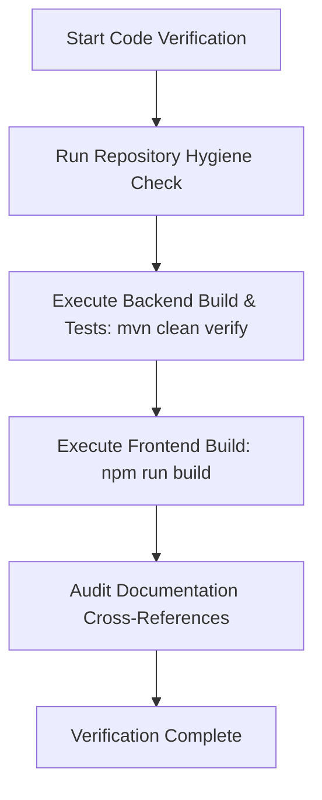

# Automated Verification Workflow

This workflow defines the mandatory sequence for validating code changes before declaring completion.

## Step Details

1. **Hygiene Audit**: Confirm zero secrets, absolute paths, or machine-specific configs are present in git status.
2. **Backend Gate**: Run `cd backend && mvn clean verify`. Ensure all unit and security integration tests pass.
3. **Frontend Gate**: Run `cd frontend && npm run build`. Ensure JS bundle builds cleanly without syntax errors.
4. **Docs Verification**: Confirm all file links in markdown use valid relative or `file:///` URIs.
