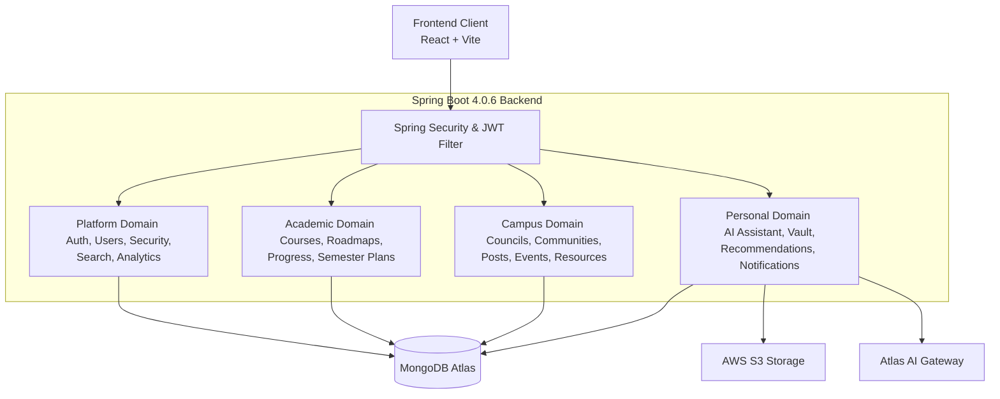

# CampusGuide System Architecture Overview

This document provides a high-level architectural overview of the CampusGuide platform. For granular API contracts, database schemas, and module specifications, refer to the documentation in [`docs/`](file:///D:/CampusGuide/docs).

---

## High-Level Domain Architecture

CampusGuide is designed as a modular 4-domain monolith, organized around distinct business domains to maximize maintainability and scalability.

---

## Core Domains

### 1. Platform Domain
- **Responsibilities**: User identity, authentication, Spring Security filters, role-based authorization (STUDENT, FACULTY, COUNCIL_ADMIN, SUPER_ADMIN), cross-domain global search, and administrative operational analytics.
- **Package**: `com.campusguide.platform`

### 2. Academic Domain
- **Responsibilities**: Course catalog management, degree roadmap requirements, student course completion tracking, GPA management, semester plan validation, and graduation eligibility evaluation.
- **Package**: `com.campusguide.academic`

### 3. Campus Domain
- **Responsibilities**: Council directory and applications, student community forums, discussion posts and comments, campus events, event registrations, and study resource sharing center.
- **Package**: `com.campusguide.campus`

### 4. Personal Domain
- **Responsibilities**: In-app event-driven notifications, student document vault, automated resume builder, Atlas AI advisor conversations, and personalized strategy-based recommendation engine.
- **Package**: `com.campusguide.personal`

---

## Architectural Principles

1. **Layered Architecture**:
   - `Controller`: Handles HTTP requests, triggers validation, and maps DTOs.
   - `Service`: Contains business logic, domain rules, and security enforcement.
   - `Repository`: Spring Data MongoDB interfaces for database access.
   - `DTO`: Explicit request and response models. Entities are never exposed directly.
2. **Stateless Authentication**: JWT bearer tokens attached to request headers.
3. **Database Single-Source-Of-Truth**: MongoDB Atlas collections specified in [`docs/db-schema.md`](file:///D:/CampusGuide/docs/db-schema.md).

For detailed domain specifications, see:
- [API Contracts](file:///D:/CampusGuide/docs/api-contracts.md)
- [Database Schema](file:///D:/CampusGuide/docs/db-schema.md)
- [Permission Matrix](file:///D:/CampusGuide/docs/permission-matrix.md)
