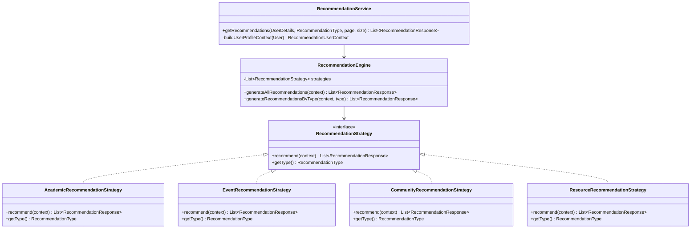

# AI Module Architecture & Gateway Integration

The AI module implements a provider-independent AI Gateway pattern to transform the CampusGuide conversation platform into an AI-powered service. 

## Overview
To remain provider-agnostic, the Spring Boot application never communicates directly with LLM providers (e.g., OpenAI, Gemini, Claude). All AI-related interactions go through a FastAPI gateway, which handles model execution, provider orchestration, and API credentials.

```mermaid
sequenceDiagram
    autonumber
    actor Student as Front-end Client
    participant SpringBoot as Spring Boot Service
    database MongoDB as MongoDB
    participant FastAPI as FastAPI AI Gateway
    participant LLM as LLM Provider (OpenAI/Gemini/etc.)

    Student->>SpringBoot: POST /api/ai/conversations/{id}/chat (ChatRequest)
    Note over SpringBoot: 1. Validate ownership & active status
    SpringBoot->>MongoDB: Save user message (USER role)
    SpringBoot->>MongoDB: Fetch conversation history (Chronological, limit N)
    Note over SpringBoot: 2. PromptBuilder resolves system instructions
    SpringBoot->>FastAPI: POST /api/v1/chat (AiGatewayRequest)
    
    rect rgb(240, 240, 240)
        Note over FastAPI: LLM Provider Orchestration
        FastAPI->>LLM: Dispatch formatted prompt & history
        LLM-->>FastAPI: Raw response + Token usage metadata
    end

    FastAPI-->>SpringBoot: Return payload (AiGatewayResponse)
    SpringBoot->>MongoDB: Save assistant response (ASSISTANT role)
    SpringBoot-->>Student: Return sanitized ChatResponse
```

---

## Configuration Properties

The AI gateway settings are configurable in `application.properties`:

| Property Key | Type | Default Value | Description |
|---|---|---|---|
| `ai.gateway.base-url` | String | `http://localhost:8000` | Target URL of the FastAPI AI Gateway. |
| `ai.gateway.timeout` | Duration | `10s` | Connect and read timeouts for gateway requests. |
| `ai.gateway.enabled` | Boolean | `true` | Globally enable/disable the AI Gateway. |
| `ai.gateway.history-limit` | Integer | `20` | Maximum number of context messages sent. |

---

## AI Gateway DTOs

### Request (`AiGatewayRequest`)
Sent from Spring Boot to FastAPI.
* `conversationId` (String): ID of the session.
* `conversationType` (String): Mode of conversation (e.g., `GENERAL_CHAT`, `ACADEMIC_ADVISOR`, `CAREER_GUIDANCE`, `CAMPUS_ASSISTANT`).
* `userMessage` (String): The newest user prompt.
* `conversationHistory` (List): Chronological list of past message roles and contents.
* `metadata` (Map): Diagnostic context containing the system prompt resolved by `PromptBuilder`.

### Response (`AiGatewayResponse`)
Received from FastAPI.
* `response` (String): Generated answer text.
* `model` (String): Active model identifier.
* `provider` (String): LLM provider (e.g., openai, gemini).
* `tokensUsed` (Integer): Count of consumed tokens.
* `processingTime` (Double): Execution duration in seconds.
* `metadata` (Map): Optional payload metadata.

---

## Prompt Engine & PromptBuilder

The `PromptBuilder` retrieves specialized system prompts from the resource path (`src/main/resources/prompts/`) based on the conversation's type:
1. **General Chat**: Friendly general assistant.
2. **Academic Advisor**: Curriculum selection & advising.
3. **Career Guidance**: Resume advice, internships, and career coaching.
4. **Campus Assistant**: Navigation, facility tracking, and campus events.

Large prompt templates are maintained inside external `.txt` files rather than hardcoded in services.

---

## Context Builder

The `ConversationContextBuilder` builds prior chronological message history in the `GatewayMessage` format. To optimize network usage and LLM context limits, history is truncated to the most recent `history-limit` messages.

---

## Fallback Engine

When the AI gateway client experiences timeouts, connection failures, or receives HTTP 5xx responses, the `AiServiceImpl` orchestrator executes a silent fallback sequence:
1. Logs the precise failure cause for backend diagnosis.
2. Intercepts the exception before it pollutes client responses.
3. Does **not** persist transient error states to the database.
4. Returns a user-friendly assistant reply: 
   > *"I'm currently unavailable. Please try again in a few moments."*

---

## Recommendation Engine (Phase 3)

The Recommendation Engine is a standalone, modular component of the AI package designed to provide deterministic, explainable, and personalized recommendations for authenticated users.

### Architecture and Design Patterns

The recommendation module implements a **Strategy Pattern** to separate the recommendation generation logic for different domain models. This design allows new recommendation categories to be added easily by introducing a new strategy implementation without modifying existing code.



### Recommendation Scoring & Rules

All recommendation scores are normalized to a `0.0 – 1.0` range and are generated deterministically based on configurable weights.

#### Weight Configuration Properties

Weights are externalized in `application.properties` under the `recommendation` prefix:
* `recommendation.academic.prerequisite-weight`: Weight for roadmap courses (Default: `0.90`).
* `recommendation.academic.department-weight`: Weight for department requirements (Default: `0.70`).
* `recommendation.academic.current-semester-weight`: Weight for current semester (Default: `0.85`).
* `recommendation.academic.missing-prereq-boost`: Boost for missing prerequisites (Default: `0.80`).
* `recommendation.event.deadline-weight`: Boost for upcoming event deadlines (Default: `0.80`).
* `recommendation.event.base-weight`: Base weight for upcoming events (Default: `0.40`).
* `recommendation.event.department-weight`: Weight for matching department (Default: `0.40`).
* `recommendation.event.community-weight`: Weight for matching communities (Default: `0.15`).
* `recommendation.community.base-weight`: Base community weight (Default: `0.40`).
* `recommendation.community.department-weight`: Community department match weight (Default: `0.45`).
* `recommendation.community.interest-weight`: Community bio interests match weight (Default: `0.15`).
* `recommendation.resource.base-weight`: Base resource weight (Default: `0.30`).
* `recommendation.resource.enrolled-weight`: Resource enrolled course match weight (Default: `0.90`).
* `recommendation.resource.roadmap-weight`: Resource roadmap course match weight (Default: `0.70`).
* `recommendation.resource.department-weight`: Resource department match weight (Default: `0.55`).

#### Recommendation Sources & Reasons

To facilitate downstream analytics and AI prompt construction, every recommendation tracks its source and reason code:

* **RecommendationSource** Enum:
  * `ROADMAP`: Suggested via student roadmap mappings.
  * `COURSE`: Suggested based on specific course mappings.
  * `EVENT`: Suggested from upcoming events.
  * `COMMUNITY`: Suggested from student interest groups.
  * `RESOURCE`: Suggested from educational study materials.
  * `SYSTEM`: Suggested globally by system rules.

* **RecommendationReason** Enum:
  * `PREREQUISITE_MATCH`: Matches prerequisite course requirements.
  * `DEPARTMENT_MATCH`: Matches the student's department.
  * `COMMUNITY_MATCH`: Matches student's community participation.
  * `POPULAR_RESOURCE`: Suggested as popular or highly relevant study materials.
  * `UPCOMING_DEADLINE`: Has a soon-closing registration deadline.


