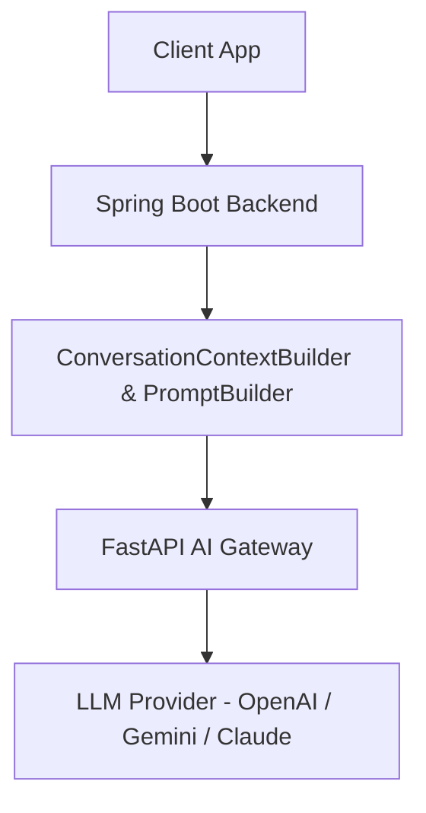

# Atlas AI Assistant Architecture

## Overview
**Atlas** is the locked, provider-independent AI intelligence engine of CampusGuide. It serves as an interactive academic, career, and campus guide for students.

---

## Architectural Principles

1. **Provider Independence**: Spring Boot never connects directly to third-party LLM providers. All calls proxy through a FastAPI AI Gateway.
2. **Non-Mutating Execution**: **Atlas NEVER mutates application or user data directly**. It provides recommendations, advisory answers, and action plans, but write operations require explicit user approval via standard domain APIs.
3. **Resilient Fallback**: If the AI gateway experiences timeouts or errors, a silent fallback intercepts exceptions and returns friendly guidance without corrupting user state.

---

## Core Components

- **Memory Engine**: Manages chronological session conversation history and context window limits.
- **Intent Engine**: Classifies user prompts to select specialized prompt templates (`GENERAL_CHAT`, `ACADEMIC_ADVISOR`, `CAREER_GUIDANCE`, `CAMPUS_ASSISTANT`).
- **Action Planner**: Generates non-mutating recommendations and navigational deep links.
- **RAG Subsystem**: Retrieves institutional knowledge and course prerequisites to ground assistant responses.

---

## Cross-References
- [Memory Engine Specification](file:///D:/CampusGuide/docs/ai/memory-engine.md)
- [RAG Architecture](file:///D:/CampusGuide/docs/ai/rag.md)
- [Intent Engine Specification](file:///D:/CampusGuide/docs/ai/intent-engine.md)
- [Action Planner Specification](file:///D:/CampusGuide/docs/ai/action-planner.md)
