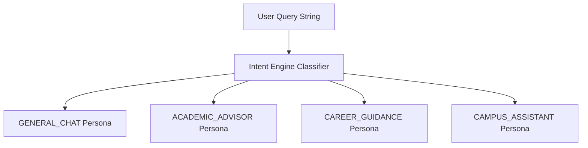

# Intent Classification Engine Architecture

## Overview
The Intent Engine categorizes incoming user queries to select appropriate persona system prompts and dispatch tailored context payloads to the AI Gateway.

---

## 1. Intent Categories & Personas

| Conversation Type | Focus Area | Resolved Prompt Resource |
|---|---|---|
| `GENERAL_CHAT` | General campus life, onboarding, open Q&A | `prompts/general_chat.txt` |
| `ACADEMIC_ADVISOR` | Course planning, prerequisites, GPA, roadmaps | `prompts/academic_advisor.txt` |
| `CAREER_GUIDANCE` | Resumes, internships, skill building, vault docs | `prompts/career_guidance.txt` |
| `CAMPUS_ASSISTANT` | Events, councils, communities, notice board | `prompts/campus_assistant.txt` |

---

## 2. Dynamic System Prompt Resolution

System prompts are stored externally in `src/main/resources/prompts/` and loaded dynamically by `PromptBuilder`. This decouples prompt template maintenance from Java application compilation.

---

## Cross-References
- [Atlas AI Architecture](file:///D:/CampusGuide/docs/ai/atlas.md)
- [Action Planner Architecture](file:///D:/CampusGuide/docs/ai/action-planner.md)
