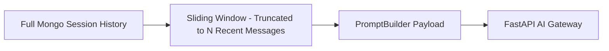

# Memory Engine Conceptual Architecture

## Overview
The Memory Engine manages conversation state, session context windows, and message persistence for Atlas AI interactions.

---

## 1. Sliding Window Context

To optimize LLM token limits and performance, the Memory Engine applies a sliding window over active conversation histories.

- **History Limit**: Configurable limit (e.g., `ai.gateway.history-limit=20`) retrieving the most recent chronological exchanges.
- **System Prompt Insertion**: The system prompt resolved by `PromptBuilder` is injected alongside user context.

---

## 2. Persistence Model

- Messages are stored immutably in the `ai_conversations` collection in MongoDB Atlas.
- Each message contains role (`USER`, `ASSISTANT`), timestamp, and content string.
- Error states and transient gateway failures are **never** persisted to the conversation history.

---

## Cross-References
- [Atlas AI Architecture](file:///D:/CampusGuide/docs/ai/atlas.md)
- [Atlas API Framework](file:///D:/CampusGuide/docs/api/atlas.md)
