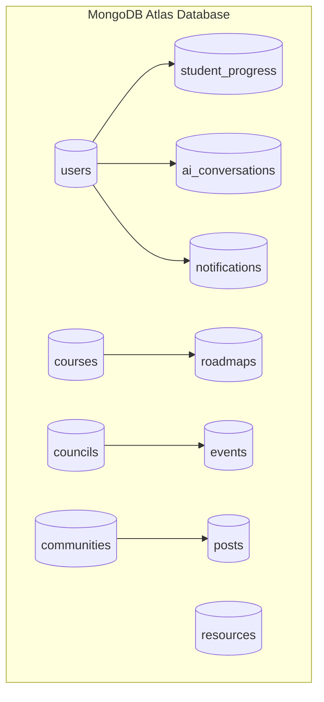

# Database Design Architecture

CampusGuide utilizes **MongoDB Atlas** as its single source of truth. Data models are designed for document store optimization, balancing embedding for read performance with referencing for data integrity.

---

## 1. Single Source of Truth Model

All domain data resides in MongoDB Atlas collections. Domains logically partition their collections while retaining consistent ID references (`String` / `ObjectId`).

---

## 2. Collection Distribution by Domain

### Platform Domain
- `users`: User identity, authentication credentials, role assignments, department, and profile details.
- `audit_logs`: Operational security logs and system activity trails.

### Academic Domain
- `courses`: Master course directory, credit values, prerequisites, and department mapping.
- `roadmaps`: Degree requirements per major and semester sequence plans.
- `student_progress`: Completed courses per student, grades, current semester plans, and computed GPA.

### Campus Domain
- `councils`: Student council structures, executive roles, and member listings.
- `communities`: Student interest groups, categories, and membership lists.
- `posts`: Forum discussion topics, posts, and embedded/referenced comments.
- `events`: Campus events, locations, timestamps, hosting council/community, and RSVPs.
- `resources`: Academic study materials, subject tags, storage URLs, and vote counts.

### Personal Domain
- `notifications`: User-specific in-app notification messages and read states.
- `ai_conversations`: Atlas AI session history, prompt contexts, and chat message sequences.
- `document_vault`: User document metadata, resume sections, and file references.

---

## 3. Design & Indexing Principles

1. **Reference vs Embed**:
   - **Embed**: Sub-entities tightly coupled to a parent lifecycle with bounded growth (e.g., chat messages in a conversation, semester course selections).
   - **Reference**: Independent domain entities or unbounded collections (e.g., user references in community memberships, courses in roadmaps).
2. **Compound Indexing**: Compound indexes support common query patterns (e.g., `{ studentId: 1, semester: 1 }` or `{ category: 1, createdAt: -1 }`).
3. **Auditing**: Standardized timestamp fields (`createdAt`, `updatedAt`) managed via Spring Data Mongo auditing.

---

## 4. Cross-References

- [Domain Architecture](file:///D:/CampusGuide/docs/architecture/domain-architecture.md)
- [Permission Model](file:///D:/CampusGuide/docs/architecture/permission-model.md)
