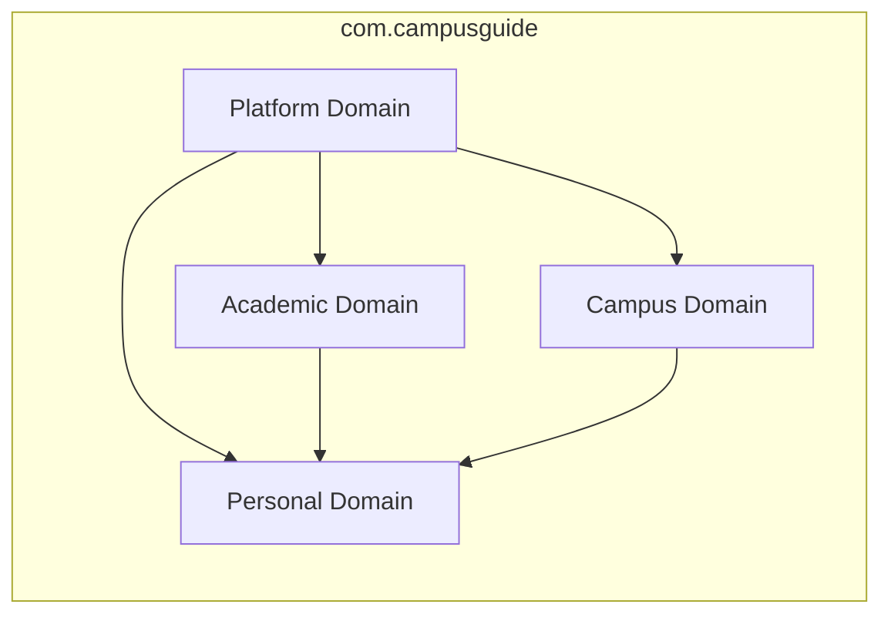

# Domain Architecture

CampusGuide strictly adheres to a **4-Domain Monolithic Architecture**. Each domain owns its business logic, entities, services, and repositories, ensuring zero circular dependencies and high domain cohesion.

---

## 1. The Four Core Domains

### 1.1 Platform Domain (`com.campusguide.platform`)
- **Core Purpose**: System foundation, identity management, and operational security.
- **Responsibilities**:
  - Authentication, JWT token lifecycle, and password management.
  - User profiles, role assignments (`STUDENT`, `FACULTY`, `COUNCIL_ADMIN`, `SUPER_ADMIN`).
  - Spring Security integration & RBAC filter chains.
  - Global cross-domain search index.
  - Administrative operational analytics.

### 1.2 Academic Domain (`com.campusguide.academic`)
- **Core Purpose**: Institutional academic lifecycle and student progress tracking.
- **Responsibilities**:
  - Master course catalog and prerequisite dependency mapping.
  - Degree roadmaps and major/minor program requirements.
  - Student academic history, completed courses, and GPA calculation.
  - Semester plan formulation and validation.

### 1.3 Campus Domain (`com.campusguide.campus`)
- **Core Purpose**: Student life, social community, events, and shared resources.
- **Responsibilities**:
  - Student councils structure, executive boards, and council applications.
  - Student interest communities, discussion forums, posts, and comments.
  - Campus events, scheduling, and RSVP registrations.
  - Centralized study resource repository (notes, past exams, syllabus guides).

### 1.4 Personal Domain (`com.campusguide.personal`)
- **Core Purpose**: Student-centric utilities, personalized AI advisor, and notification engine.
- **Responsibilities**:
  - Event-driven in-app notifications and delivery preferences.
  - Student document vault and automated resume builder.
  - Atlas AI Advisor chat sessions and prompt context construction.
  - Recommendation engine (Strategy pattern for Academic, Campus, and Resource suggestions).

---

## 2. Interaction & Boundary Rules

1. **Service-to-Service Invocations**: Cross-domain calls must occur strictly via Service interfaces, never by directly querying repositories belonging to another domain.
2. **DTO Boundary Protection**: Domain entities must never cross the Controller layer. DTOs are mandatory for all API contracts.
3. **No Circular Dependencies**: Lower-level platform domains must never depend on high-level feature domains.

---

## 3. Cross-References

- [System Overview](file:///D:/CampusGuide/docs/architecture/system-overview.md)
- [Database Design](file:///D:/CampusGuide/docs/architecture/database-design.md)
- [Permission Model](file:///D:/CampusGuide/docs/architecture/permission-model.md)
