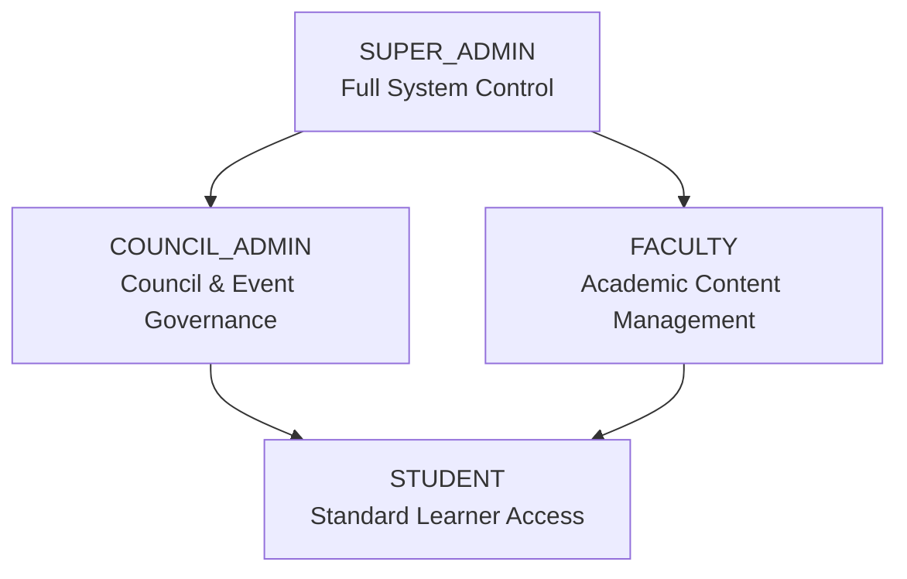
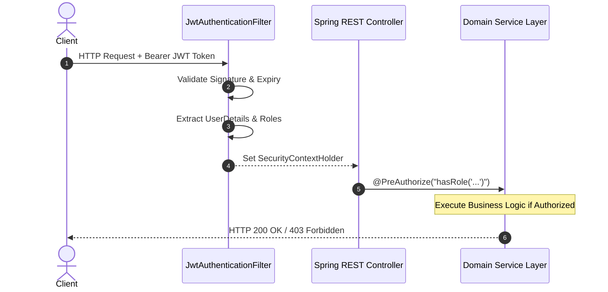

# Permission & Authorization Model

CampusGuide implements Role-Based Access Control (RBAC) integrated directly into Spring Security 6.x and secured via JWT Bearer authentication.

---

## 1. User Roles

The platform defines four primary system roles:

| Role | Hierarchy Level | Key Permissions |
|---|---|---|
| `SUPER_ADMIN` | 4 (Highest) | Platform governance, user role management, system settings, global analytics. |
| `COUNCIL_ADMIN` | 3 | Manage council profiles, create & edit council events, broadcast notices, review council applications. |
| `FACULTY` | 3 | Course catalog updates, academic roadmap validation, study resource verification. |
| `STUDENT` | 1 (Base) | Access academic planner, join communities, view events, submit applications, use Atlas AI, manage personal vault. |

---

## 2. Authorization Flow

---

## 3. Security Principles

1. **Stateless Tokens**: JWTs contain user identity (`userId`), email, and roles. No server-side session state is held.
2. **Method-Level Security**: High-risk operations enforce `@PreAuthorize` annotations at the service or controller level.
3. **Resource Ownership**: Users may only mutate their own personal resources (e.g., semester plans, document vault, AI chat histories) unless elevated permissions are present.

---

## 4. Cross-References

- [Domain Architecture](file:///D:/CampusGuide/docs/architecture/domain-architecture.md)
- [API Authentication](file:///D:/CampusGuide/docs/api/authentication.md)
