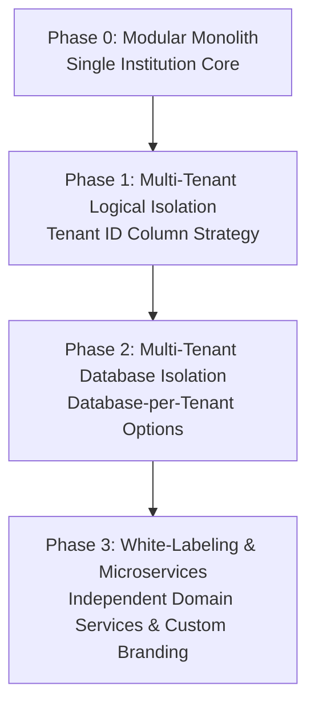

# Future SaaS Roadmap

This document outlines the strategic architectural trajectory for transitioning CampusGuide from a single-institution platform into a multi-tenant Software-as-a-Service (SaaS) solution for higher education institutions.

---

## 1. Architectural Evolution Vision

---

## 2. Multi-Tenancy Strategy

### 2.1 Tenant Context Resolution
- **Subdomain Routing**: Requests resolved via header or subdomain (e.g., `stanford.campusguide.io`).
- **Tenant Context Holder**: ThreadLocal context carrying `tenantId` across controller, service, and data access layers.

### 2.2 Data Isolation Modes
1. **Pooled / Logical Isolation (Phase 1)**: All entities contain a indexed `tenantId` field. Automatic Mongo criteria injection ensures strict query boundary enforcement.
2. **Siloed Isolation (Phase 2)**: High-tier enterprise clients receive dedicated MongoDB databases or isolated Atlas clusters.

---

## 3. Customization & White-Labeling

- **Custom Branding**: Institution-specific logo, primary/secondary CSS color tokens, and navigation configurations.
- **Custom Curricula**: Configurable grading scales, credit unit definitions, and academic calendar structures.
- **SSO Integration**: SAML 2.0 / OAuth2 / OIDC integration with institutional Identity Providers (e.g., Shibboleth, Azure AD, Okta).

---

## 4. Cross-References

- [System Overview](file:///D:/CampusGuide/docs/architecture/system-overview.md)
- [Domain Architecture](file:///D:/CampusGuide/docs/architecture/domain-architecture.md)
