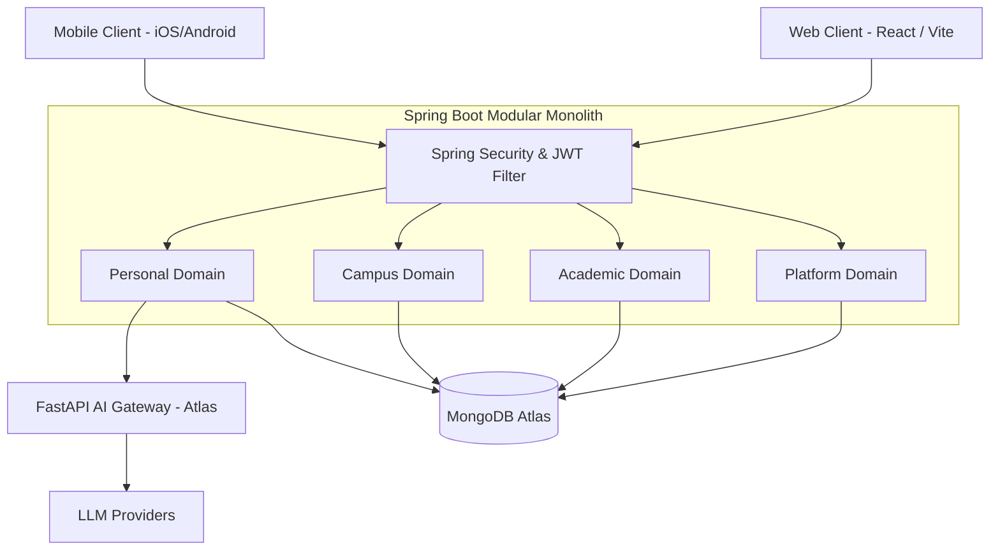

# System Overview

## Product Vision

**CampusGuide** is a comprehensive, AI-powered campus management and academic advisory platform. It bridges the gap between student academic planning, campus community engagement, administrative workflows, and personalized AI guidance. The platform serves as a unified digital ecosystem for students, faculty, council admins, and university administrators.

---

## Technical Stack & Architecture Style

CampusGuide is designed as a **modular monolith** running on Java 25 and Spring Boot 4.0.6, backed by MongoDB Atlas.

---

## High-Level System Context

1. **Clients**: Web front-end (React + Vite) and Mobile apps consume RESTful APIs via JSON over HTTPS.
2. **Security Gateway**: Stateless JWT authentication and Spring Security filter chains validate requests and enforce Role-Based Access Control (RBAC).
3. **Core Backend**: Clean domain-driven modular monolithic architecture containing four business domains.
4. **Data Layer**: Single source of truth managed via Spring Data MongoDB Atlas.
5. **AI Subsystem (Atlas)**: External FastAPI AI Gateway providing LLM integration, prompt management, and intelligent context processing.

---

## Technical Stack Summary

- **Backend Framework**: Java 25 / Spring Boot 4.0.6
- **Database**: MongoDB Atlas (Spring Data MongoDB)
- **Security**: Spring Security 6.x, JWT (JJWT library)
- **AI Gateway**: FastAPI (Python), provider-independent abstraction layer
- **Frontend Stack**: React, Vite, Vanilla CSS / Tailwind tokens
- **Build System**: Apache Maven

---

## Cross-References

- [Domain Architecture](file:///D:/CampusGuide/docs/architecture/domain-architecture.md)
- [Database Design](file:///D:/CampusGuide/docs/architecture/database-design.md)
- [Permission Model](file:///D:/CampusGuide/docs/architecture/permission-model.md)
- [SaaS Roadmap](file:///D:/CampusGuide/docs/architecture/saas-roadmap.md)
