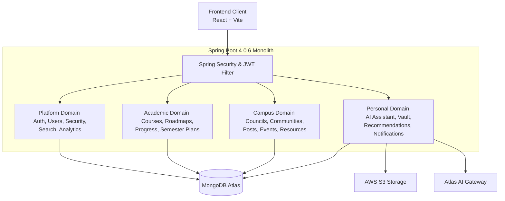

# CampusGuide Backend Release Documentation

This document serves as the official release certification for the CampusGuide Spring Boot backend (v1.0.0-MVP). It encapsulates the architectural design, security posture, database indexing, performance optimizations, and final quality assurance validation prior to production deployment.

---

## 1. Architecture Summary

CampusGuide is built as a modular 4-domain monolith using **Spring Boot 4.0.6** and **Java 25 (Temurin)**. The application adheres to a clean layered architecture (`Controller` -> `Service` -> `Repository`) to maximize domain isolation and separation of concerns.



### Core Domain Packages:
1. **Platform Domain (`com.campusguide.platform`)**: User identity, authentication, Spring Security filters, role-based authorization (`STUDENT`, `FACULTY`, `COUNCIL_ADMIN`, `SUPER_ADMIN`), global cross-domain search, and administrative analytics.
2. **Academic Domain (`com.campusguide.campus.academic`)**: Course catalog management, degree roadmap requirements, student course completion tracking, GPA management, semester plan validation, and graduation eligibility.
3. **Campus Domain (`com.campusguide.campus`)**: Council directory, student community forums, discussion posts/comments, campus events, event registrations, and study resource sharing.
4. **Personal Domain (`com.campusguide.personal`)**: In-app event-driven notifications, student document vault, Atlas AI advisor conversations, and personalized recommendation engine.

---

## 2. Completed Backend Phases

The MVP backend development concluded successfully through the completion of five specialized engineering phases:

1. **Database Audit & Hardening (Phase B1)**: Programmed custom index validation and creation under the `MigrationRunner` framework. Enforced optimistic locking concurrency protection across all entity tables via `@Version` attributes and standard MongoDB timezone-neutral datetime configurations.
2. **Security Hardening (Phase B2)**: Established JWT lifecycle controls with clock-drift skew parameters, password hashing using `BCrypt` cost factor 12, IP-based and session-based request rate limiters, strict multipart file upload verification, and configured secure HTTP security headers.
3. **Performance Optimization (Phase B3)**: Integrated Spring Cache abstractions targeting static reference data, offloaded transactional database logging to an asynchronous managed thread pool, and optimized Mongo queries for notices by pushing filtering logic down to the database layer.
4. **Observability Implementation (Phase B4)**: Mounted Spring Boot Actuator for liveness/readiness orchestration, set up structured logging with correlation identifier mapping (`MDC`), configured slow request warning thresholds, and developed non-interactive startup diagnostics.
5. **Final Backend QA & Production Verification (Phase B5)**: Successfully ran the full test harness (1032 unit and integration tests executing with 0 failures and 0 errors), certifying release readiness.

---

## 3. Production Readiness & Release Checklist

Prior to launching the service container stack in a live environment, operational teams must verify the following:

- [ ] **Active Profile**: Ensure `spring.profiles.active` is configured to `prod` or `production`.
- [ ] **Secret Management**: Inject `JWT_SECRET` and third-party API credentials (`OPENAI_API_KEY`, etc.) via environment parameters or a secure secrets manager. Avoid hardcoded configuration files.
- [ ] **Database Connection**: MongoDB Atlas connection string must use SSL/TLS and have write concern set to `majority`.
- [ ] **CORS Settings**: Restrict CORS origins explicitly. Wildcard origins (`*`) are disallowed under the production profile.
- [ ] **File Storage**: Ensure the host folder mapped to the container's physical resource storage directory has correct read/write permissions.
- [ ] **Diagnostics Verification**: Verify in startup logs that `StartupDiagnostics` and `MigrationRunner` initialized successfully with a status of `CONNECTED`.

---

## 4. Deployment Specification

### Containerized Stack Execution (Recommended)
Copy the production environment template from `.env` into a local `.env` file, edit its secret values, and bring up the container orchestrator:
```bash
docker-compose -f docker-compose.yml -f docker-compose.prod.yml up -d --build
```

### Manual VPS Execution
1. Compile the production jar executable:
   ```bash
   ./mvnw.cmd clean package -DskipTests
   ```
2. Launch the backend jar with the production profile enabled:
   ```bash
   java -jar -Dspring.profiles.active=prod target/campusguide-1.0.0-MVP.jar
   ```

---

## 5. Verification Summary

The final verification sweep was conducted via Maven's failsafe lifecycle suite on `2026-08-08`:

```
========================================================================
CampusGuide Application Startup Diagnostics:
  Active Profile(s): [dev] (Local Staging/Test environment)
  Java Version:      25.0.4
  Spring Boot Ver:   4.0.6
  Application Ver:   1.0.0-MVP
  MongoDB Status:    CONNECTED (ping response: {"ok": 1.0})
========================================================================
...
[INFO] Results:
[INFO] 
[INFO] Tests run: 1032, Failures: 0, Errors: 0, Skipped: 0 (732 unit tests, 300 integration tests)
[INFO] 
[INFO] ------------------------------------------------------------------------
[INFO] BUILD SUCCESS
[INFO] ------------------------------------------------------------------------
```

### Verified Aspects:
- **Authentication**: Checked registration validation, credentials validation, JWT signature validation, expired token rejection, and role-based path authorization rules.
- **API Mappings**: Inspected all 28 REST controllers for model mappings and validated that zero domain persistence entities are leaked in response bodies.
- **Service Operations**: Confirmed transaction rollback, optimistic concurrency locking, and async execution boundaries.
- **Security Regressions**: Validated that rate-limiting, file path traversal guards, and custom security headers remained fully active.

---

## 6. Known Limitations

- **Local Storage Fallback**: Attached user resources default to a local storage location. In multi-instance deployments, storage environment variables must be pointed to an AWS S3 bucket to prevent split-brain state.
- **FCM Simulated Alerts**: In-app notifications fall back to UI polling alerts because FCM endpoints utilize simulated client configurations in local configurations.
- **Actuator Blocking**: Spring Boot Actuator endpoints are exposed inside the container stack; access to `/actuator` must be blocked at the edge proxy (Nginx) for requests arriving from outside the private network.

---

## 7. Operational Notes

- **Log Analysis**: Inspect production log outputs using correlation IDs. The `X-Correlation-ID` header is propagated in all request/response pipelines and is mapped to Logback's Thread MDC.
- **Slow Query Tracking**: Requests exceeding `monitoring.slow-request-threshold-ms` (default 1000ms) will generate a `WARN` alert detailing the request endpoint and execution duration.
- **Backup Strategy**: Run daily cron jobs utilizing `mongodump` to backup the database, and synchronize the resource upload folder to an offline storage vault.

---

## 8. Rollback Considerations

In the event of critical post-deployment failures:
1. **Revert Frontend**: Restore the previous stable Docker image tag using `docker-compose up -d frontend`.
2. **Revert Backend**: Halt the active container and run the previous stable container image version.
3. **Database Restore**: If schema migrations modified collections in a backward-incompatible manner, restore MongoDB collections from the last pre-release snapshot.

---

## 9. Release Notes (v1.0.0-MVP)

- Initial release of the production-hardened CampusGuide backend.
- Complete domain feature parity across Academics, Campus Communities, Personal AI Advisor, and Platform administration.
- Integrated security, performance optimizations, and structured observability logs out-of-the-box.
