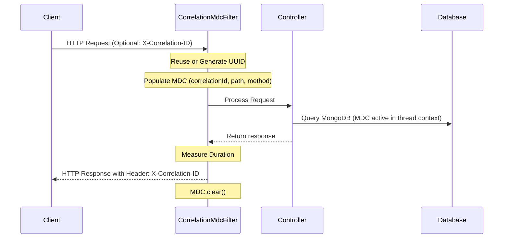

# CampusGuide Backend Observability & Production Monitoring

This document details the observability and production monitoring architecture implemented in the CampusGuide Spring Boot backend.

---

## 1. Spring Boot Actuator Endpoints

Spring Boot Actuator is configured to expose key health, diagnostic, and metrics endpoints safely in production.

### Endpoint Security

Actuator endpoints are divided into **Public (Safe)** and **Protected (Sensitive)** classes:

| Endpoint Path | Category | Description | Access Control |
|---|---|---|---|
| `/actuator/health` | Public | Overall system health status (UP/DOWN) | Permitted (Anonymous) |
| `/actuator/health/liveness` | Public | Liveness probe indicating if app is running | Permitted (Anonymous) |
| `/actuator/health/readiness` | Public | Readiness probe indicating if app is ready for traffic | Permitted (Anonymous) |
| `/actuator/info` | Public | Build and version info | Permitted (Anonymous) |
| `/actuator/metrics` | Protected | Detailed metric identifiers | **Authenticated Only** (`ROLE_SUPER_ADMIN`) |
| `/actuator/metrics/{metric}` | Protected | Query individual metric values | **Authenticated Only** (`ROLE_SUPER_ADMIN`) |

### Configuration

Actuator exposure and security rules are configured in [application.properties](file:///D:/CampusGuide/backend/src/main/resources/application.properties):

```properties
# Actuator Exposure
management.endpoints.web.exposure.include=health,info,metrics
# Hide details from unauthorized public requests
management.endpoint.health.show-details=when-authorized
management.endpoint.health.probes.enabled=true
management.info.env.enabled=true
```

And enforced in [SecurityConfig.java](file:///D:/CampusGuide/backend/src/main/java/com/campusguide/common/config/SecurityConfig.java):

```java
.requestMatchers(
        "/actuator/health",
        "/actuator/health/**",
        "/actuator/info"
).permitAll()
```

---

## 2. Health Probes & Connectivity Auditing

The health system monitors multiple critical subcomponents. When details are requested (by an authenticated administrator), the health endpoint returns structured metrics for each component:

1. **Liveness Probe** (`/actuator/health/liveness`): Indicates if the JVM process is healthy and functioning.
2. **Readiness Probe** (`/actuator/health/readiness`): Indicates if the application is fully started and accepting client connections.
3. **MongoDB Connectivity**: Audited automatically via `MongoHealthIndicator`. Ensures database read/write queries can be serviced.
4. **Disk Space**: Audited automatically via `DiskSpaceHealthIndicator`. Warns if disk usage exceeds the threshold.
5. **Application Startup**: Captured via Spring Boot's internal `ApplicationStartup` lifecycle and logs showing state changes.

---

## 3. Micrometer Metrics

Production metrics are collected and formatted using Micrometer, making them compatible with Prometheus scraping or other monitoring agents:

- **JVM Metrics**: Garbage collection timing, JVM memory pool allocations (heap/non-heap), class-loading details.
- **Memory**: Resident and virtual memory allocations, heap allocation rate.
- **Garbage Collection**: Stop-the-world pause frequencies, reclamation durations.
- **Thread Pools**: Active thread counts, thread state distributions (RUNNABLE, WAITING, etc.).
- **HTTP Requests**: Response latency percentiles, error rates (4xx and 5xx), request volume throughput.
- **MongoDB Metrics**: Outgoing database commands, latencies, connection pool statistics. Configured via the `MongoMetricsCommandListener` bean registered in [MongoConfig.java](file:///D:/CampusGuide/backend/src/main/java/com/campusguide/common/config/MongoConfig.java).

---

## 4. Structured Logging

Logging is standardized via [logback-spring.xml](file:///D:/CampusGuide/backend/src/main/resources/logback-spring.xml):

- **Format**: Structured log lines including timestamp, severity level, thread name, class name, MDC request context, and target message.
- **Timestamps**: Unified ISO-8601 formatting (`yyyy-MM-dd HH:mm:ss.SSS`).
- **Logger Naming**: Clean limits (`%-40.40logger{39}`) to prevent alignment shifting.
- **Exception Logging**: Clean, formatted stack trace prints.
- **Duplicate Prevention**: Logger `additivity="false"` is set on `com.campusguide` to ensure logs are processed exactly once and prevent console log spam.
- **Privacy & Security**: Zero password, JWT secret, or user PII logging is permitted.

---

## 5. Request Correlation & MDC Logging

Every incoming HTTP request goes through the [CorrelationMdcFilter](file:///D:/CampusGuide/backend/src/main/java/com/campusguide/common/config/CorrelationMdcFilter.java). This filter runs with the highest precedence (`Ordered.HIGHEST_PRECEDENCE`) to track requests.



### Propagated MDC Fields

The following logging tokens are active during request execution:

1. **`correlationId`**: The transaction token (reused from header `X-Correlation-ID` or generated automatically).
2. **`requestPath`**: Request URI (e.g. `/api/v1/courses`).
3. **`httpMethod`**: HTTP verb (e.g. `GET`, `POST`).

The filter guarantees that MDC is cleared in a `finally` block to prevent thread contamination.

---

## 6. Slow Request Monitoring

A lightweight, zero-overhead request timer checks request duration against a configurable threshold:

- **Property**: `monitoring.slow-request-threshold-ms` (Defaults to `1000` ms).
- **Behavior**: Requests exceeding the threshold are logged at the `WARN` level with the correlation ID, HTTP path, and elapsed duration.
- **Performance**: Calculated using cheap `System.currentTimeMillis()` operations to avoid overhead. No logs are produced for normal, fast requests.

---

## 7. Startup Diagnostics

On application startup, the [StartupDiagnostics](file:///D:/CampusGuide/backend/src/main/java/com/campusguide/common/config/StartupDiagnostics.java) component executes a diagnostic routine:

- Reports **active environment profiles**, **Java version**, **Spring Boot version**, and **application version**.
- Performs a **MongoDB connection check** by issuing a `{ping: 1}` command.
- Exposes no credentials or environment secrets in the console logs.

---

## 8. Operational Readiness & Graceful Shutdown

To prevent dropped requests during container scaling or rolling deployments, graceful shutdown is enabled:

1. **Graceful Application Termination**:
   Configured in `application.properties`:
   ```properties
   server.shutdown=graceful
   spring.lifecycle.timeout-per-shutdown-phase=30s
   ```
2. **Async Thread Pools**:
   The asynchronous task executor in [AsyncConfig.java](file:///D:/CampusGuide/backend/src/main/java/com/campusguide/common/config/AsyncConfig.java) waits for tasks to complete:
   ```java
   executor.setWaitForTasksToCompleteOnShutdown(true);
   executor.setAwaitTerminationSeconds(30);
   ```
3. **Manual Executors**:
   Custom thread pools in [ExecutionDispatcher.java](file:///D:/CampusGuide/backend/src/main/java/com/campusguide/personal/ai/atlas/execution/runtime/engine/ExecutionDispatcher.java) and [AtlasStreamingServiceImpl.java](file:///D:/CampusGuide/backend/src/main/java/com/campusguide/personal/ai/atlas/streaming/AtlasStreamingServiceImpl.java) are registered with `@PreDestroy` hooks to ensure clean resource release.

---

## 9. Troubleshooting Guidance

### No Correlation IDs in Log Messages
Verify that your logging appender includes the MDC parameters. Check that `%X{correlationId}` is defined in the Logback pattern.

### Disk Space Alerts
Check the disk space threshold configured in Spring Boot. By default, Actuator reports a `DOWN` state if disk space drops below 10MB. Adjust using:
`management.health.diskspace.threshold=100MB`

### Thread Pool Exhaustion
If the server fails to shut down within the 30-second phase limit, verify active threads in thread pools using `/actuator/metrics/jvm.threads.live`. Increase `spring.lifecycle.timeout-per-shutdown-phase` if heavy tasks require more time.
