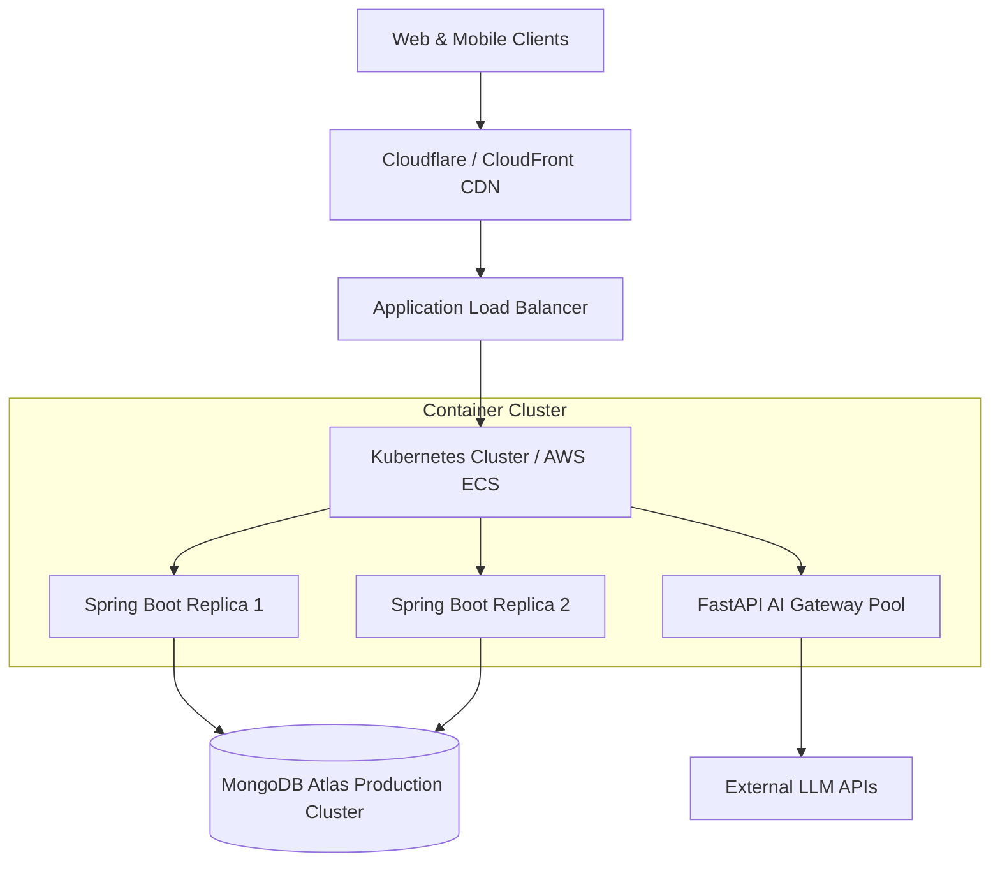

# Production Deployment & Infrastructure Strategy

This document details the production architecture, cloud deployment, database scaling, and secrets management strategy.

---

## 1. Production Architecture Overview

---

## 2. Production Deployment Process

<!-- PLACEHOLDER: Production Deployment -->
*CI/CD pipeline steps, blue-green deployment strategies, and health check validation routines.*

---

## 3. Database & Storage Configuration

<!-- PLACEHOLDER: Database Configuration -->
*Production Atlas cluster tier selection, replica set configuration, connection pooling (`maxSize=100`), and automated backups.*

---

## 4. Secrets Management

<!-- PLACEHOLDER: Secrets Management -->
*Integration with AWS Secrets Manager, HashiCorp Vault, or Kubernetes Secrets for managing JWT secret keys and database credentials.*

---

## Cross-References
- [Environment Matrix](file:///D:/CampusGuide/docs/deployment/environment.md)
- [System Overview Architecture](file:///D:/CampusGuide/docs/architecture/system-overview.md)
