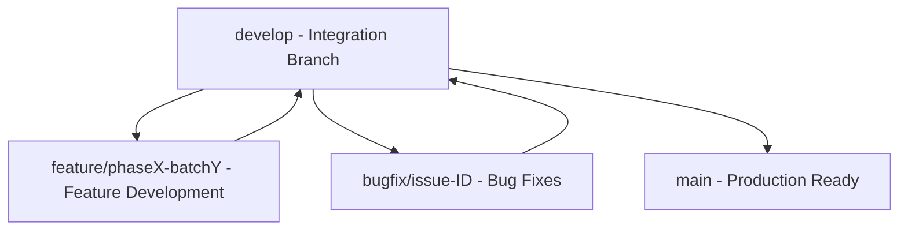

# Git Branching Strategy & Workflow

CampusGuide uses a modified **Gitflow** branching strategy focused on batch-driven development.

---

## 1. Branch Topology

### 1.1 Long-Lived Branches
- `main`: Contains production-stable code. Releases are tagged (`v1.0.0`).
- `develop`: Primary integration branch for active development.

### 1.2 Short-Lived Branches
- `feature/<phase>-<batch>`: Created from `develop` for batch implementations (e.g., `feature/phase0-batch0.3`).
- `bugfix/<issue-id>`: Created from `develop` to resolve reported bugs.
- `hotfix/<version>`: Created directly from `main` for critical production hotfixes.

---

## 2. Batch Workflow & Code Review Rules

1. **Branch Creation**: Always branch off the latest `develop`.
2. **Commit Isolation**: Make logical, atomic commits conforming to [Commit Conventions](file:///D:/CampusGuide/docs/development/commit-conventions.md).
3. **Automated Verification**: Before opening a Pull Request, verify that `mvn clean verify` succeeds locally.
4. **Mandatory Documentation Update**: No PR may be merged unless documentation has been updated to reflect code changes ([Documentation Lock Rule](file:///D:/CampusGuide/docs/README.md)).

---

## Cross-References
- [Commit Conventions](file:///D:/CampusGuide/docs/development/commit-conventions.md)
- [Testing Strategy](file:///D:/CampusGuide/docs/development/testing-strategy.md)
