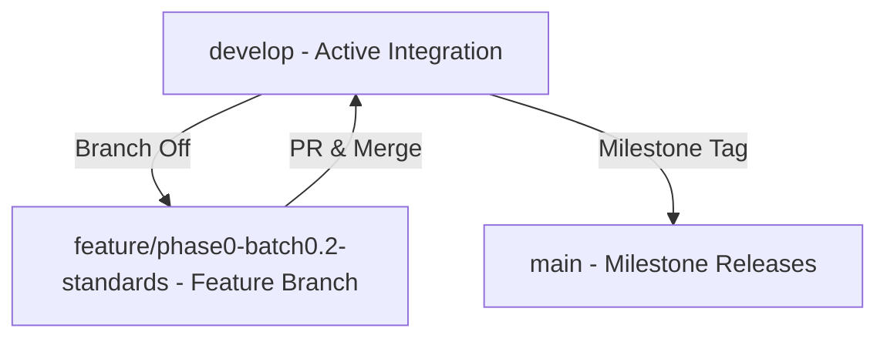

# Git Workflow Documentation

This document outlines the Git branching strategy, workflow rules, and release guidelines for CampusGuide.

---

## 1. Branch Topology & Strategy

CampusGuide follows a structured batch-driven Git workflow based on an integration-branch model:

- **`main`**: Production-stable releases. Receives code ONLY from milestone releases via `develop`. **Never commit directly to `main`.**
- **`develop`**: Integration branch for active development. All feature branches merge into `develop`.
- **`feature/<phase>-<batch>-<feature>`**: Feature branches for specific implementation batches (e.g., `feature/phase0-batch0.2-engineering-standards`).



---

## 2. Core Workflow Rules

1. **Origin of Feature Branches**:
   - All feature branches MUST originate directly from `develop`.
   - Naming pattern: `feature/<phase>-<batch>-<feature>` or `bugfix/<issue-id>`.

2. **Batch Merges**:
   - Every completed batch or feature branch must open a Pull Request (PR) against `develop`.
   - Merges into `develop` require automated build & test verification (`mvn clean verify` for backend, `npm run build` for frontend).

3. **Milestone Releases**:
   - `main` only receives tested, milestone-ready releases merged from `develop`.
   - Releases are tagged with semantic versions (e.g., `v1.0.0`).

4. **Direct Commits Prohibited**:
   - Direct pushes to `main` are strictly prohibited.
   - Pushes to `develop` should be done via pull requests or verified batch commits.

---

## 3. Step-by-Step Batch Workflow

### Step 1: Create Branch
```bash
git checkout develop
git pull origin develop
git checkout -b feature/phase0-batch0.2-engineering-standards
```

### Step 2: Implement & Commit
- Follow [Commit Conventions](./commit-convention.md).
- Keep commits logical and atomic.

### Step 3: Local Verification
```bash
# Backend Verification
mvn clean verify -f backend/pom.xml

# Frontend Verification
cd frontend && npm run build
```

### Step 4: Open Pull Request
- Create PR from `feature/<phase>-<batch>-<feature>` to `develop`.
- Fill out `.github/pull_request_template.md`.

---

## Cross-References
- [Commit Conventions](./commit-convention.md)
- [Architecture Principles](./architecture-principles.md)
- [Code Style Guide](./code-style.md)
