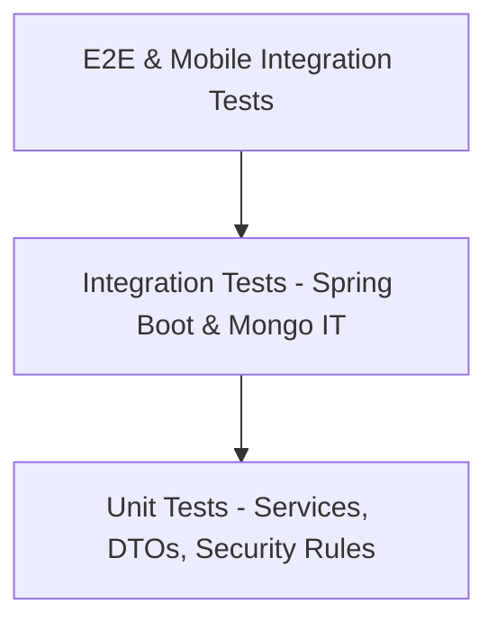

# Testing Strategy & Quality Philosophy

CampusGuide enforces a multi-layered testing pyramid to guarantee platform reliability, security boundaries, and domain integrity.

---

## 1. Testing Pyramid



---

## 2. Testing Levels & Philosophy

### 2.1 Unit Tests (`src/test/java/.../*Test.java`)
- **Scope**: Service logic, validation algorithms, recommendation scoring strategies, DTO mappers.
- **Frameworks**: JUnit 5, Mockito, AssertJ.
- **Rule**: Mock external dependencies (repositories, AI gateway clients). Fast execution (< 5 seconds).

### 2.2 Integration Tests (`src/test/java/.../*IT.java`)
- **Scope**: REST Controller security filters, Spring Data Mongo queries, RBAC access checks.
- **Frameworks**: `@SpringBootTest`, `MockMvc`, Embedded/Local MongoDB.
- **Rule**: Verify HTTP status codes, security boundaries, and database query correctness.

---

## 3. Verification Commands

Run full verification locally prior to committing:
```bash
mvn clean verify
```
This executes both Unit Tests (`maven-surefire-plugin`) and Integration Tests (`maven-failsafe-plugin`).

---

## Cross-References
- [Code Style Guide](./code-style.md)
- [Git Workflow](./git-workflow.md)
