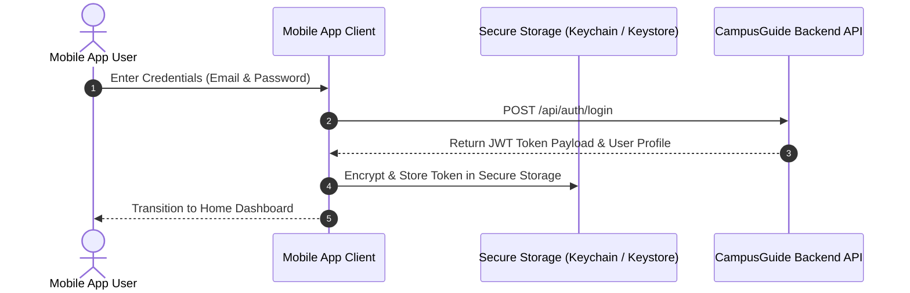

# Mobile Authentication & Token Lifecycle

This document specifies the mobile client authentication flow, token storage, refresh token handling, and biometric integration.

---

## 1. Authentication Sequence Flow

---

## 2. Secure Token Storage

- **iOS**: Save JWT token in iOS **Keychain Services** via `SecItemAdd`.
- **Android**: Save JWT token in Android **EncryptedSharedPreferences** / Keystore.
- **Cross-Platform**: Never store authentication tokens in unencrypted AsyncStorage or plain SQLite tables.

---

## 3. Biometric Authentication Integration

Mobile clients may wrap token retrieval with local biometric authentication (FaceID / TouchID / Fingerprint) to unlock local app sessions without requiring re-entry of password credentials.

---

## Cross-References
- [Mobile API Reference](file:///D:/CampusGuide/docs/mobile/api-reference.md)
- [Backend Authentication API](file:///D:/CampusGuide/docs/api/authentication.md)
