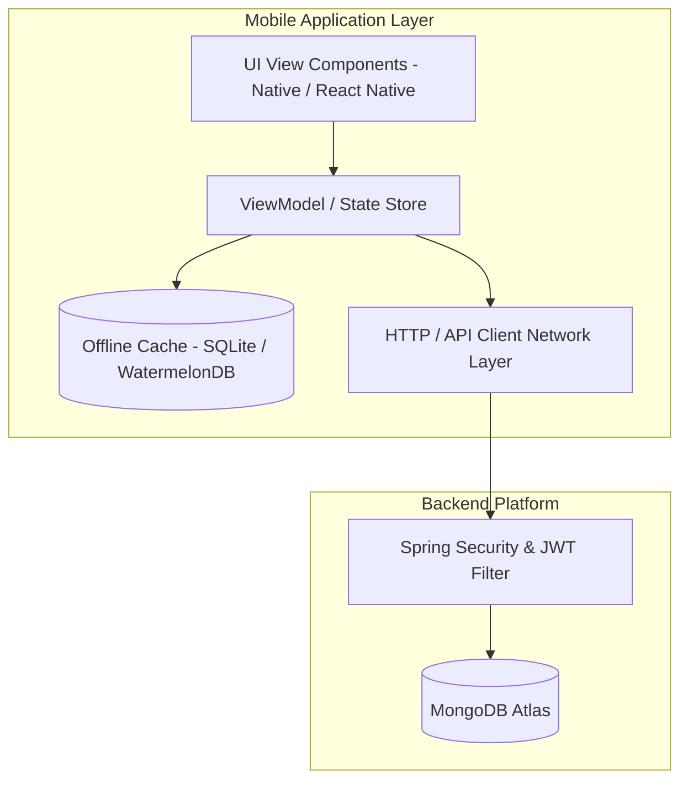

# Mobile Architecture Overview

## Objective
This document outlines the client architecture, backend interaction strategy, and design patterns for building native or cross-platform CampusGuide mobile applications (iOS / Android / React Native).

---

## 1. High-Level Architecture

---

## 2. Core Operational Principles

1. **Self-Contained Mobile Specs**: Mobile engineers can develop against the contracts defined in `docs/mobile/` without needing to inspect backend Spring Boot source code.
2. **Offline-First Resilience**: Mobile clients cache essential read datasets (e.g., student degree progress, calendar events, active notifications) locally to support offline inspection.
3. **Stateless API Interaction**: Every authenticated request passes a JWT Bearer token in the `Authorization` header.

---

## Cross-References
- [Mobile API Reference](file:///D:/CampusGuide/docs/mobile/api-reference.md)
- [Mobile Navigation](file:///D:/CampusGuide/docs/mobile/navigation.md)
- [Offline Strategy](file:///D:/CampusGuide/docs/mobile/offline-strategy.md)
