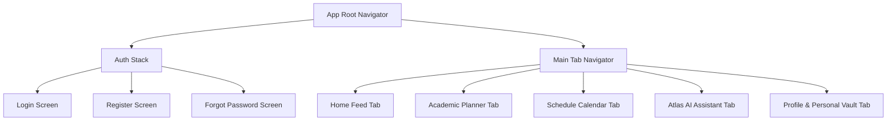

# Mobile Navigation & Screen Hierarchy

This document maps out the screen hierarchy, tab navigation, and deep linking routes for the mobile application.

---

## 1. Application Screen Hierarchy

---

## 2. Deep Linking Specification

The mobile app registers the custom URL scheme `campusguide://` and universal links `https://app.campusguide.io/`:

| Path Scheme | Target Screen | Context Parameters |
|---|---|---|
| `/events/{eventId}` | Event Detail Screen | `eventId`: Unique event ID |
| `/notices/{noticeId}` | Notice Modal View | `noticeId`: Unique notice ID |
| `/ai/chat/{conversationId}` | Atlas Chat Screen | `conversationId`: AI session ID |
| `/planner/semester/{term}` | Semester Detail Plan | `term`: Academic term (e.g. `FALL_2026`) |

---

## Cross-References
- [Mobile Overview](file:///D:/CampusGuide/docs/mobile/mobile-overview.md)
- [UI Guidelines](file:///D:/CampusGuide/docs/mobile/ui-guidelines.md)
