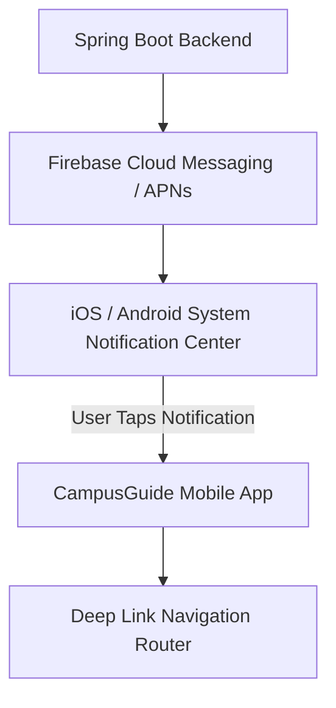

# Mobile Notifications & Push Payload Reference

This document covers push notification integration via Firebase Cloud Messaging (FCM) / Apple Push Notification service (APNs) and in-app alert centers.

---

## 1. Push Notification Architecture



---

## 2. Notification Payload Format

Push payloads include data attributes to enable direct deep linking:

```json
{
  "aps": {
    "alert": {
      "title": "New Notice Published",
      "body": "Midterm exam timetable has been released."
    },
    "badge": 1,
    "sound": "default"
  },
  "data": {
    "notificationId": "notif-9872",
    "category": "ACADEMIC",
    "targetRoute": "/notices/notice-451"
  }
}
```

---

## Cross-References
- [Notifications Module Architecture](file:///D:/CampusGuide/docs/modules/notifications.md)
- [Mobile Navigation](file:///D:/CampusGuide/docs/mobile/navigation.md)
