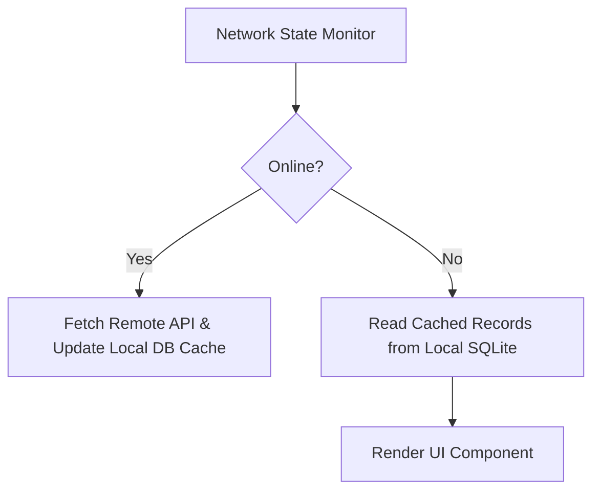

# Mobile Offline Strategy & Data Sync

This document defines the offline caching, local data persistence, mutation queuing, and conflict resolution strategy for mobile apps.

---

## 1. Local Persistence Architecture

Mobile clients maintain a local SQLite / WatermelonDB cache mirroring key domain records:

---

## 2. Offline Availability Matrix

| Domain Feature | Offline Read | Offline Write / Queue | Sync Mechanism |
|---|---|---|---|
| Student Progress & Roadmap | Full Cache | Read-Only | Auto-refresh on connect |
| Semester Plan | Full Cache | Queue Local Edit | Background HTTP sync on reconnect |
| Community Posts & Feeds | Cached Recent Posts | Read-Only | Refresh feed on pull-to-refresh |
| Schedule Calendar | Full Cache | Read-Only | iCal / Local database sync |
| Atlas AI Chat | Read Past History | Disabled | Re-enable when online |

---

## 3. Conflict Resolution

When local offline edits conflict with server-side updates (e.g. concurrent semester plan changes), the server response returns `409 Conflict` with the canonical server state. The mobile app prompts the student to overwrite local drafts or apply server state.

---

## Cross-References
- [Mobile Overview](file:///D:/CampusGuide/docs/mobile/mobile-overview.md)
- [Mobile API Reference](file:///D:/CampusGuide/docs/mobile/api-reference.md)
