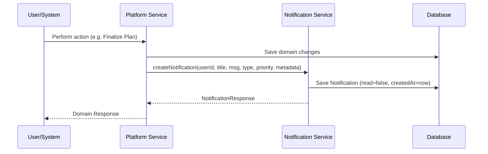

# Notification Module Documentation

## Overview
The Notification Module establishes a modular, event-driven system to deliver personalized in-app notifications to authenticated users on the CampusGuide platform. Notifications are generated dynamically from platform events and support complete read/unread tracking, pagination, ownership validation, and extensibility for future external delivery channels.

---

## Domain Model

### Notification Entity
Stored in the MongoDB collection `notifications`.

* **id**: `String` (Unique identifier)
* **userId**: `String` (Indexed reference to the User)
* **title**: `String` (Brief heading)
* **message**: `String` (Detailed notification body)
* **type**: `NotificationType` (Enum)
* **priority**: `NotificationPriority` (Enum)
* **read**: `boolean` (Flag indicating read status)
* **metadata**: `Map<String, Object>` (Flexible key-value map for payload or future enhancements)
* **createdAt**: `LocalDateTime` (Timestamp of creation)
* **readAt**: `LocalDateTime` (Timestamp when marked as read)

---

## Core Enums

### NotificationType
Supported notification categories:
* **SYSTEM**: Critical system updates, maintenance announcements, or alerts.
* **ACADEMIC**: Course additions, roadmap publications, and plan finalizations.
* **EVENT**: Reminders, capacity alerts, and registration status updates.
* **COMMUNITY**: Discussion comments, membership updates, and posts.
* **AI**: Recommended actions and personalized insights.
* **REMINDER**: Deadlines, schedules, and general task reminders.

### NotificationPriority
Prioritization of delivery/importance:
* **LOW**: Non-intrusive updates.
* **NORMAL**: Standard platform notifications.
* **HIGH**: Time-critical information (e.g., registration deadlines, plan finalization confirmations).

---

## Notification Lifecycle & Workflows

### 1. Creation Workflow
Notifications are generated internally by simple service calls when platform events occur. Direct controller creation is avoided to keep the system modular and secure.

### 2. Read / Unread Workflow
Users fetch notifications through paginated endpoints.
* **Unread State**: Marked `read = false` with `readAt = null`.
* **Marking as Read**: Sets `read = true` and populates `readAt` with the current timestamp. The original `createdAt` timestamp remains unchanged.
* **Security & Ownership**: For every read and delete operation, the system resolves the authenticated user context and verifies that `notification.userId` matches the authenticated user's ID. Mismatches result in an `AccessDeniedException` (returns `403 Forbidden`).

---

## Existing Event Integrations
The following platform events trigger notification generation in this phase:

1. **Roadmap Publication** (`RoadmapService`)
   - **Type**: `ACADEMIC`
   - **Trigger**: Creating/Publishing a new academic roadmap.
   - **Message**: "Your academic roadmap '[Title]' has been successfully published."

2. **Semester Plan Finalization** (`SemesterPlanService`)
   - **Type**: `ACADEMIC`
   - **Priority**: `HIGH`
   - **Trigger**: Finalizing a semester course plan.
   - **Message**: "Your plan for Semester [Number] has been successfully finalized."

3. **Event Registration Confirmed** (`EventRegistrationService`)
   - **Type**: `EVENT`
   - **Trigger**: Authenticated student registers for an active event.
   - **Message**: "You have successfully registered for the event: [Event Title]"

4. **New Recommendations Available** (`RecommendationService`)
   - **Type**: `AI`
   - **Trigger**: Fetching recommendations, if no unread AI notification currently exists for the user.
   - **Message**: "We have generated new personalized recommendations for you. Explore them in the AI dashboard!"
