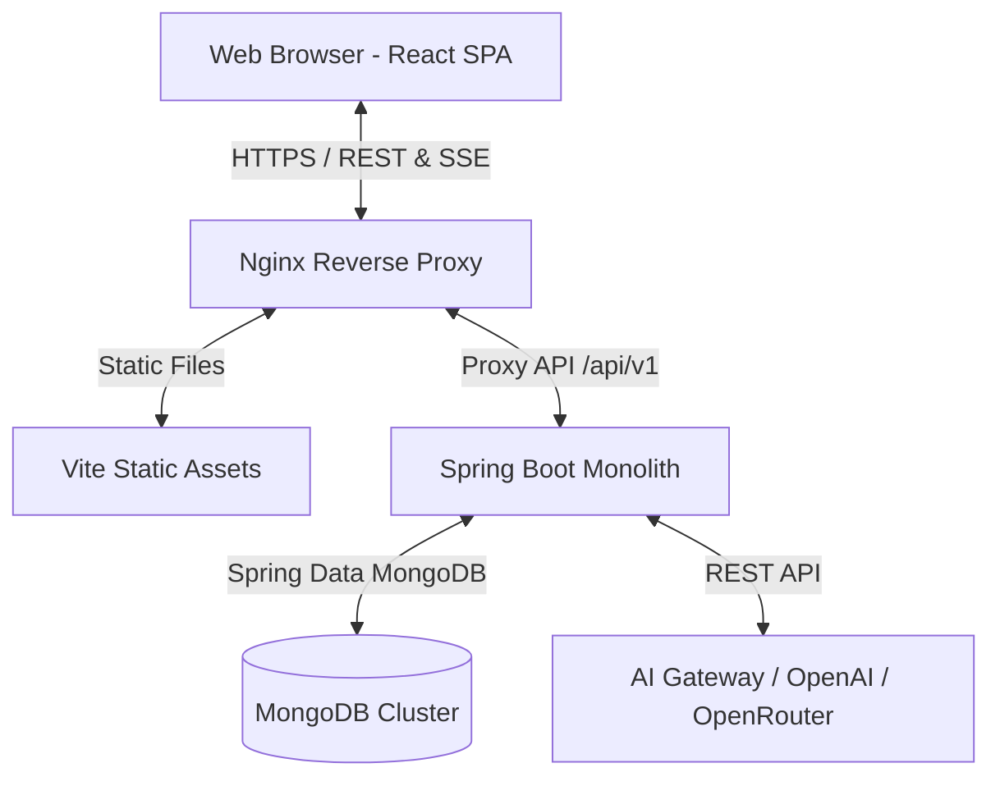
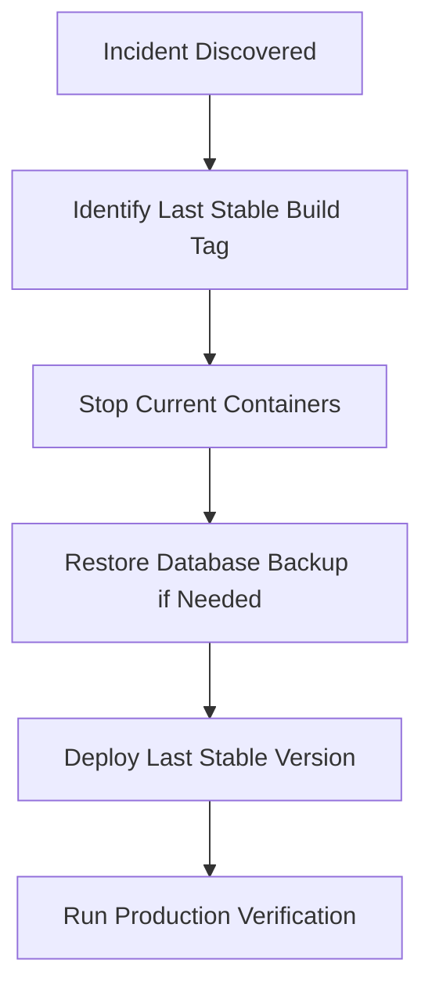

# CampusGuide Production Release & Deployment Guide (v1.0.0-MVP)

This document is the canonical production release guide for CampusGuide `v1.0.0-MVP`. It consolidates architecture details, deployment runbooks, monitoring checklists, rollback procedures, and disaster recovery strategies.

---

## 1. Architecture Summary

CampusGuide is built on a clean 4-domain decoupled monolith architecture:



### Domain Segregation
* **Platform Domain**: User security, authentication (JWT), global search, and administrator analytics.
* **Academic Domain**: Course catalog directory, credit tracking, department pathways/roadmaps, and semester planning.
* **Campus Domain**: Council directories, discussion forums (posts/comments), events (RSVP/results), and student resource sharing.
* **Personal Domain**: In-app/FCM push notifications, resume builder, personal document vault, and Atlas AI advisor.

---

## 2. Deployment Checklist

Follow this checklist to deploy a new version of CampusGuide using Docker Compose:

### Prerequisites
* Target Host OS: Linux VPS (Ubuntu 22.04 LTS recommended)
* Installed dependencies: Docker v24+, Docker Compose v2.20+
* Domain name configured with DNS pointing to VPS (A / AAAA records)
* SMTP Gateway Credentials (AWS SES, Mailgun, or SendGrid)
* OpenAI API key or OpenRouter API key

### Step 1: Environment Configuration
Create a production environment file (`.env`) in the root directory. 
Ensure it contains all required properties without defaults.

```bash
# General
PORT=8080
LOG_LEVEL=INFO

# Security
JWT_SECRET=YOUR_SECURE_GENERATED_JWT_SECRET_KEY_MIN_32_CHARS
JWT_EXPIRATION=86400000

# MongoDB Production
MONGO_ROOT_USER=admin
MONGO_ROOT_PASSWORD=YOUR_STRONG_MONGO_PASSWORD

# SMTP Gateway
MAIL_HOST=smtp.sendgrid.net
MAIL_PORT=587
MAIL_USERNAME=apikey
MAIL_PASSWORD=YOUR_SMTP_API_KEY

# Atlas AI Subsystem
OPENAI_API_KEY=YOUR_OPENAI_API_KEY
OPENAI_BASE_URL=https://api.openai.com/v1
```

> [!CAUTION]
> Never commit the `.env` file to version control. Ensure `.env` is listed in your `.gitignore` and `.dockerignore`.

### Step 2: Launch Deployment Stack
Deploy the application services via Docker Compose:

```bash
# Build images and start containers in detached mode
docker-compose -f docker-compose.yml -f docker-compose.prod.yml up -d --build
```

### Step 3: Run Post-Deployment Verification
Verify that all containers are healthy and running:

```bash
docker ps
```

Verify application logs:

```bash
docker logs campusguide-backend-prod --tail 100
docker logs campusguide-frontend-prod --tail 100
```

---

## 3. Production Verification Checklist

Before opening the portal to users, perform these checks:

- [ ] **SSL/TLS Active**: Check that connection uses HTTPS and certificates are valid.
- [ ] **HTTP Headers Audit**: Verify that `X-Frame-Options: DENY`, `X-Content-Type-Options: nosniff`, and HSTS headers are returned.
- [ ] **CORS Active**: Verify that origins are explicitly defined; wildcards (`*`) must fail when authentication headers are present.
- [ ] **Liveness / Readiness Probes**: Curl the `/actuator/health` endpoint:
  ```bash
  curl http://localhost:8080/actuator/health
  ```
  Expected output: `{"status":"UP"}`.
- [ ] **Atlas AI Connectivity**: Run a test prompt in the Atlas AI chat interface and verify real-time Server-Sent Events (SSE) stream does not buffer.
- [ ] **Asset Compression**: Inspect network tab to verify static resources use gzip or Brotli compression.

---

## 4. MVP Capabilities

The initial `v1.0.0-MVP` includes these core features:

| Domain | Feature | Capabilities |
| :--- | :--- | :--- |
| **Platform** | RBAC Security | Dynamic user registration, JWT logins, and role-based routes for Students, Faculty, and Admin. |
| | Global Search | Cross-module indexed search for all system entities. |
| **Academic** | Course Mapping | Prerequisite check validation, graduation eligibility, and custom roadmaps. |
| **Campus** | Forum & Events | Council pages, threaded comments, RSVPs, and competition result boards. |
| **Personal** | Atlas AI Advisor | Contextual course recommendation, schedule assistance, and SSE token streaming. |

---

## 5. Known Limitations & Workarounds

* **Local Storage Fallback**: Attached resources are uploaded to `/app/uploads` on the container's local volume. For high-availability clustering, map a shared Network File System (NFS) volume or toggle the Amazon S3 driver active in `application-prod.properties`.
* **FCM Alerts simulation**: Mobile notification updates use in-app polling in the browser header since Web Push notifications are disabled in development profile states.
* **Touch Support in Calendar**: Drag-and-drop calendar sorting is optimized for desktop pointers. Mobile users should tap tasks to edit schedule dates manually.
* **Atlas Context Window**: In exceptionally long chat sessions, the oldest contextual conversation items are truncated to fit inside the 8,000-token window. Resetting the thread clears the buffer.

---

## 6. Monitoring & Logging

### Health Probes
* Liveness: `/actuator/health/liveness` (Confirms JVM is running).
* Readiness: `/actuator/health/readiness` (Confirms MongoDB connection and Atlas AI providers are responsive).

### Prominent Metrics Exporter
Standard Micrometer indicators are exposed under `/actuator/metrics`. Monitor these key gauges:
* `jvm.memory.used`: JVM heap memory usage.
* `atlas.requests`: Count of Atlas requests tagged by `status` (success/failure) and `provider`.
* `atlas.latency.provider`: Network and model processing latency of OpenAI.
* `atlas.circuitbreaker.events`: Tracks if the provider circuit breaker transitions to `OPEN` or `HALF_OPEN` state.

---

## 7. Rollback Procedure

If a critical incident or regression is discovered post-deployment, execute these rollback operations:



### Rollback Runbook

1. **Rollback Services**:
   Deploy the last verified stable build tag:
   ```bash
   # Revert to last stable commit tag or image version
   export RELEASE_TAG=v1.0.0-RC1
   docker-compose -f docker-compose.yml -f docker-compose.prod.yml up -d
   ```
2. **Database Point-in-Time Recovery**:
   If the release introduced breaking changes to the database schemas:
   * Access the MongoDB Atlas Dashboard.
   * Navigate to **Clusters** -> **Backup**.
   * Select **Point-in-Time Restore** to rollback schemas to the timestamp immediately preceding the release deployment window.

---

## 8. Incident Recovery Procedures

### Scenario A: Startup Validator Failures
* **Symptom**: Backend container crash-loops. Logs output `Startup Configuration Validation Failed` or `JWT Secret under 32 characters`.
* **Fix**: Edit the `.env` configuration file. Ensure `JWT_SECRET` is at least 32 characters, and `DATABASE_URL` matches the production cluster credentials. Run `docker-compose up -d` to reload.

### Scenario B: AI Gateway / OpenAI Offline (HTTP 503)
* **Symptom**: Atlas AI queries fail instantly. Logs show circuit breaker transitions to `OPEN`.
* **Fix**: The system will automatically degrade gracefully for users. Check OpenAI/OpenRouter API quotas and billing statuses. Once API availability is restored, the circuit breaker will transition to `HALF_OPEN` after 30 seconds and heal itself.

### Scenario C: MongoDB Connection Drop
* **Symptom**: REST endpoints return HTTP 500. Backend log outputs `MongoTimeoutException`.
* **Fix**: Verify DNS resolution in the container network. If Atlas is online, verify that the host VPS external IP has not changed and remains whitelist-allowed in MongoDB Atlas Network Security IP Access Lists.

### Scenario D: Storage Disk Full
* **Symptom**: File uploads fail with `IOException`.
* **Fix**: Add a cron job to prune system logs and temporary files:
  ```bash
  docker system prune -af --volumes
  ```
  Ensure `/app/uploads` is mounted to a volume with appropriate disk quotas.
